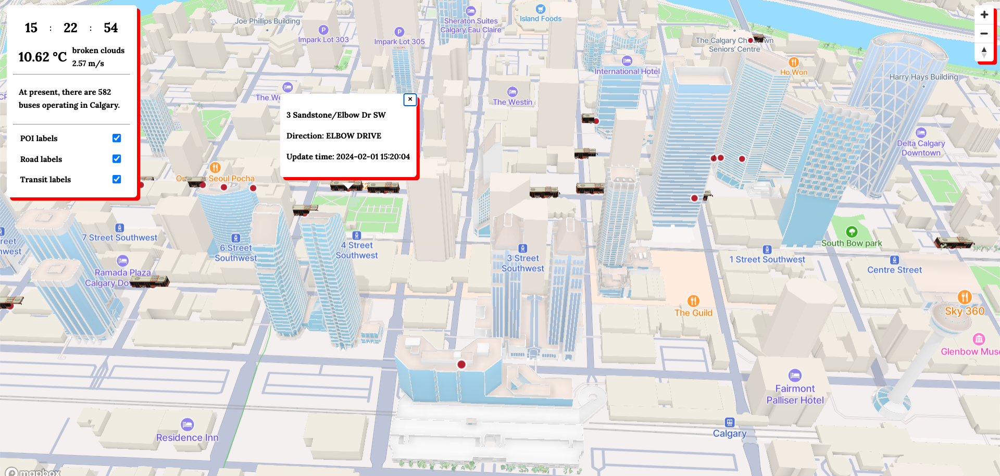

# MiniCalgaryBusMap

MiniCalgaryBusMap is a dynamic, real-time bus map application that tracks and showcases the current locations of buses within Calgary. By utilizing relevant data provided by the City of Calgary, this application combines the power of JavaScript and Java to deliver an interactive and user-friendly map interface. Users can easily monitor bus movements, and access transportation information through this application.

Inspired by: [Mini tokyo 3d](minitokyo3d.com "really really cool realtime map for metro in tokyo!!")





## Features
- Real-time bus location tracking in Calgary
- Interactive bus map using Mapbox
- Data sourced from the City of Calgary (The GTFS data source refreshes and updates every 30 seconds for up-to-date information.)
- The map theme and light preset now adapt dynamically based on the current time

## Technologies
### Frontend
- JavaScript
  - Mapbox GL JS library

### Backend
- Java
  - Spring Boot
  - MyBatis
  - Gradle

## Getting Started
To set up miniCalgaryBusMap on your local machine, follow these instructions:

### Prerequisites
- Mapbox account and API key
- Open Weather account and API key

### Installation
1. Clone the repository

```
git clone https://github.com/yourusername/miniCalgaryBusMap.git
```


2. Change to the project's root directory

```
cd miniCalgaryBusMap/
```


3. Install the required npm dependencies

```
npm install
```


4. Set your API keys
- Create a new config file as "frontend/config.js" and add your API keys as follows:

```
const config = {
    mapboxAccessToken: your mapbox key,
    openWeatherToken: your open weather key,
    mapboxStyle: your mapbox style link,
}
export default config;
```


5. Run the application

```
./gradlew bootRun
```


6. Open your browser and navigate to `http://localhost:5500/` to access the miniCalgaryBusMap.